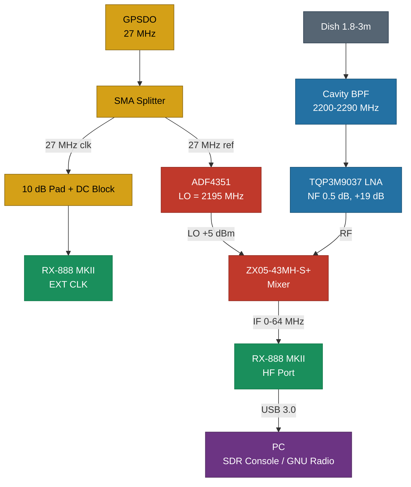
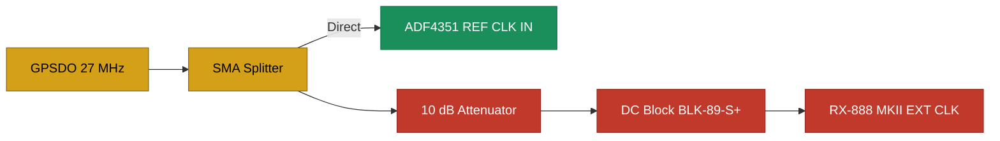

# SkyEdge S-band Downconverter

**DIY S-band downconverter for tracking Artemis II Orion MPCV and deep-space spacecraft.**

Built for NASA's volunteer one-way Doppler tracking program.

## What it does

Converts S-band signals (2195-2259 MHz) down to HF (0-64 MHz) for direct sampling by an RX-888 MKII SDR. A single fixed Local Oscillator at 2195.0 MHz, locked to a GPS-disciplined reference, provides sub-Hz frequency accuracy required for Doppler measurements.

## Target frequencies

| Spacecraft | Frequency | IF output | Notes |
|---|---|---|---|
| **Artemis II Orion** | 2216.5 MHz | 21.5 MHz | TDRS return link 1, primary target |
| DSCOVR | 2215.0 MHz | 20.0 MHz | L1 point, always visible, good calibration source |
| Coriolis | 2221.5 MHz | 26.5 MHz | LEO, 512 ksym/s |
| GOES-15 / EWS-G2 | 2209.1 MHz | 14.1 MHz | GEO 61.5E, carrier only |
| RPOD Orion | 2203.2 MHz | 8.2 MHz | Docking system |
| Brite-PL 2 | 2234.4 MHz | 39.4 MHz | Polish satellite |
| CHEOPS | 2208.5 MHz | 13.5 MHz | ESA, dumps to Europe |
| BlueWalker-3 | 2245.0 MHz | 50.0 MHz | Encrypted |
| CFOSAT | 2262.5 MHz | 67.5 MHz | At edge of range |

## Block diagram



## Hardware

### You need

| Component | Model | Purpose | Est. cost |
|---|---|---|---|
| Mixer | Mini-Circuits ZX05-43MH-S+ | Passive downconversion | ~$42 |
| DC block | Mini-Circuits BLK-89-S+ | Protect RX-888 clock input | ~$15 |
| Attenuator | SMA 10 dB, 2W | Reduce GPSDO level for RX-888 | ~$6 |
| SMA splitter | Resistive tee | Split GPSDO to ADF4351 + RX-888 | ~$6 |
| SMA cables | Male-male, 15-20 cm x 4 | Interconnects | ~$15 |
| **Total** | | | **~$85** |

### You already have

| Component | Model | Purpose |
|---|---|---|
| SDR receiver | RX-888 MKII | 16-bit ADC, HF direct sampling 0-64 MHz |
| PLL synthesizer | ADF4351 board v1.4 | LO generation, 2195 MHz |
| LNA | TQP3M9037 | Low noise amplifier, NF 0.5 dB, gain 19 dB |
| Bandpass filter | Cavity BPF 2200-2290 MHz | Front-end selectivity |
| GPSDO | Leo Bodnar Mini | 27 MHz GPS-locked reference |
| Microcontroller | Arduino Nano (CH340G) | One-time ADF4351 programming via SPI |
| Dish antenna | 1.8-3 m parabolic | S-band reception |

## Firmware

See [`firmware/ADF4351_SkyEdge_27MHz.ino`](firmware/ADF4351_SkyEdge_27MHz.ino)

### Upload

1. Install CH340G driver if needed
2. Arduino IDE - Board: **Arduino Nano** - Processor: **ATmega328P (Old Bootloader)**
3. Upload sketch
4. Open Serial Monitor at **115200 baud** - verify output
5. Check **LED LOCK** on ADF4351 board - must be ON (PLL locked)

### Wiring: Arduino Nano to ADF4351

| Arduino Nano | Function | ADF4351 pin |
|---|---|---|
| D13 | SPI clock (SCK) | CLK |
| D11 | SPI data (MOSI) | DATA |
| D10 | Latch enable (SS) | LE |
| 5V | Chip enable | CE |
| GND | Ground | GND |

D12 (MISO) is not connected - ADF4351 SPI is write-only.

## Clock distribution

The GPSDO 27 MHz output is split to two destinations with different requirements:



**Why the attenuator + DC block?**

The RX-888 MKII external clock input connects directly to an internal Si5351 synthesizer with no termination, no DC blocking, and diode clamping to GND/3.3V. Driving it with a raw 3.3V square wave causes ringing, double-clocking, or damage. The 10 dB attenuator reduces the signal to ~1V p-p and provides resistive termination. The DC block capacitor prevents DC ground loops between devices.

See [KA7OEI's detailed analysis](http://ka7oei.blogspot.com/2024/03/using-external-clock-with-rx-888-mk2.html) for background.

**ADF4351 does not need conditioning** - its REFIN input has 100k impedance and accepts 0.7V-3.3V p-p signals natively.

### Leo Bodnar configuration

Set output to **27.000000 MHz** using the USB configuration tool. Drive strength: **16 mA or higher** (must deliver 0.7V p-p or more to ADF4351 after the splitter ~6 dB loss).

### RX-888 MKII setup

1. Move the internal jumper to **EXT** (external clock)
2. Connect clock signal to the EXT CLK SMA (via attenuator + DC block)

## SDR Console V3 configuration

1. **Radio - Definitions - Converter - Edit - Add**
2. Name: `SkyEdge S-band`
3. RX Converter Frequency: `2195000000`
4. Type: Down converter
5. Save - select converter - Start radio
6. Tune to **2216.5 MHz** - the display now shows true RF frequency

## PLL calculations

```
Reference:  27.0 MHz (GPSDO)
PFD:        27.0 MHz (R=1, no doubler, no RDIV2)
VCO:        4390.0 MHz
RF divider: 2 (VCO/2 = 2195 MHz, needed because 2195 < VCO min 2200)
N:          162 + 16/27 = 162.592592...
INT:        162
FRAC:       16
MOD:        27

Verification: (162 + 16/27) x 27.0 / 2 = 2195.000000 MHz (exact, zero error)

Prescaler:  8/9 (required: VCO 4390 > 3600 MHz)
INT minimum: 75 (for 8/9 prescaler) - 162 >= 75 OK
FRAC < MOD:  16 < 27 OK
PFD <= 32 MHz (frac-N limit): 27 <= 32 OK
```

**Important:** Using MOD = REF_MHZ (27) gives exact frequency. Using MOD = 1000 (a common shortcut) would produce FRAC = 593/1000, introducing a 5.5 kHz LO error.

## Deliverable for NASA

The tracking system produces **CCSDS TDM** (Tracking Data Message) files containing RECEIVE_FREQ + UTC timestamps, submitted to NASA SCaN via the volunteer ground station program.

## References

- [ADF4351 datasheet (Analog Devices)](https://www.analog.com/media/en/technical-documentation/data-sheets/adf4351.pdf)
- [ZX05-43MH-S+ datasheet (Mini-Circuits)](https://www.minicircuits.com/pdfs/ZX05-43MH-S+.pdf)
- [RX-888 external clock (KA7OEI)](http://ka7oei.blogspot.com/2024/03/using-external-clock-with-rx-888-mk2.html)
- [RX-888 clock interface (Turn Island Systems)](https://turnislandsystems.com/rx888-external-clock-interface-kit/)
- [Leo Bodnar GPSDO](https://www.leobodnar.com/shop/index.php?main_page=index&cPath=107)

## License

MIT License - see [LICENSE](LICENSE)
